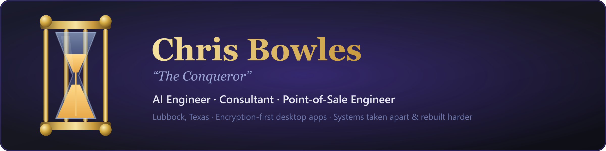

**AI Engineer · Consultant · Point-of-Sale Engineer**
I build AI-driven systems and point-of-sale platforms, ship secure desktop software, and advise teams on getting it right — with an artist's eye for how it all comes together.

🚀 **Currently:** hardening **Conquered Time** for its multi-platform release — Windows shipping, macOS &amp; Linux next.

---

## 👋 About

I take systems apart to understand them, then rebuild them harder and cleaner. Fifteen years as an IT engineer and technical-support specialist taught me how real systems fail; the rest of my path — game design, competitive gaming, creative teaching, and now AI — taught me how to make them hold.

- 🤖 **AI Engineer** — I design and build AI-driven tooling and automation, wiring models into real workflows that ship.
- 🧭 **Consultant** — I advise teams on architecture, security, and quality, then help them execute — not just diagnose.
- 🛒 **Point-of-Sale Engineer** — I build and integrate point-of-sale systems, from the transaction flow to the hardware it runs on.
- 🔒 **Security-minded builder** — encryption-at-rest, hardened desktop apps, and adversarial QA tooling are my default, not an afterthought.
- 🎨 **Artist & art teacher** — a former full-time artist and art instructor; I still lead small classes now and then, and that eye for design carries into everything I build.

---

## 🔥 What I'm building

### ⏱️ [Conquered Time](https://github.com/Conqueror-Mod/conquered-time) *(private beta)*
**Professional time-intelligence for remote pros juggling multiple clients.** A secure desktop time tracker where everything lives in an **AES-256-encrypted local vault** — no cloud, no account server, no outbound calls.

- 🔒 **Security-first** — AES-256-GCM at rest, PBKDF2 (310k) key derivation, TOTP MFA + Windows Hello, one-time recovery, hardened sandboxed Electron with a strict CSP
- 🌌 **Company Galaxy** — your client network as an interactive packed-bubble map, with identity colors that follow each company across the whole app
- 🧾 **Invoicing & audit** — turn tracked hours into numbered PDF invoices; an audit engine flags punch discrepancies; scheduled email reports over your own SMTP
- ⚡ **Lives in the tray** — global clock-in/out hotkey, idle nudges, and a self-updater that ships new versions straight from GitHub Releases
- 🛠️ **Under the hood** — Electron · TypeScript (strict) · sql.js (WASM SQLite, zero native deps) · property-tested crypto paths

### 🧪 The Crucible 
The adversarial QA tooling I use to keep apps like Conquered Time honest. Point it at any website, Electron app, or **native desktop app**; it crawls every reachable state, runs adversarial probes, and emits an auto-debug report — structured as a **DMAIC** campaign with **PDCA** fix loops.

- 🦀 Rust core · 🌲 native accessibility walkers (Windows UIA · macOS AX · Linux AT-SPI) · 🎭 Playwright adapter for web/Electron over CDP

### 🔐 Project-Gambit *(private)*
A universal device-encryption method — encryption-at-rest applied as a first principle, not a bolt-on.

---

## 🧰 Toolbox

---

## 📊 Stats

---

*"Melt it down under adversarial load, and prove what survives."*

**Reach me**

